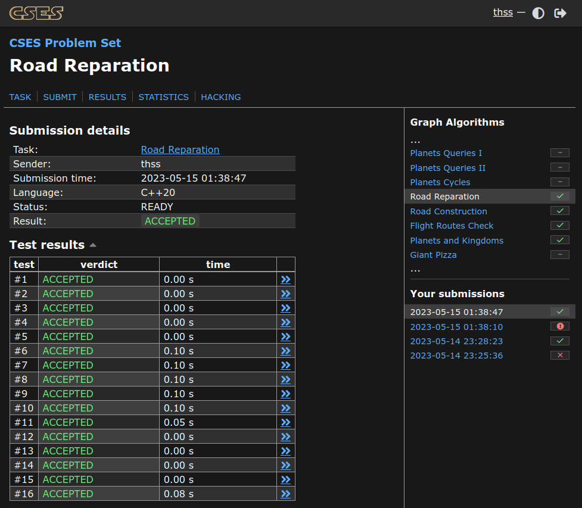

# Grafos 2 Exercícios CP

**Número da Lista**: 43 
**Conteúdo da Disciplina**: Grafos 2 

## Alunos
|Matrícula | Aluno |
| -- | -- |
| 19/0117401  |  Thalisson Alves G. de Jesus |

## Sobre 
Foram selecionados alguns exercícios que abordam o conteúdo visto no módulo de Grafos 2. Cada exercício possui uma pasta com o seu nome e dentro dela há um arquivo com a solução em C++.

## Screenshots

### Exercício 1 - [Road Reparation](./Read-Reparation/)

**Conteúdo**:
- MSP
- Kruskal

### Exercício 2 - [Flight Discount](./Flight-Discount/)

**Conteúdo**:
- Shortest Path
- Dijkstra

### Exercício 3 - [Flight Routes](./Flight-Routes/)
**Conteúdo**:
- Shortest Path
- Dijkstra

## Instalação 
**Linguagem**: C++ 
**Framework**: (caso exista) 
**Pré-requisitos**: gcc, g++

## Uso 

Para submeter as soluções siga os passos abaixo.

1. Entre na página do exercício, um link para ela pode ser encontrado no título `README.md` do exercício desejado.
2. Copie o código `solution.cpp` da mesma pasta que o `README.md`.
3. Submeta o código copiado no juiz online.

## Outros 

O vídeo pode ser acessado [aqui](video.mp4).
